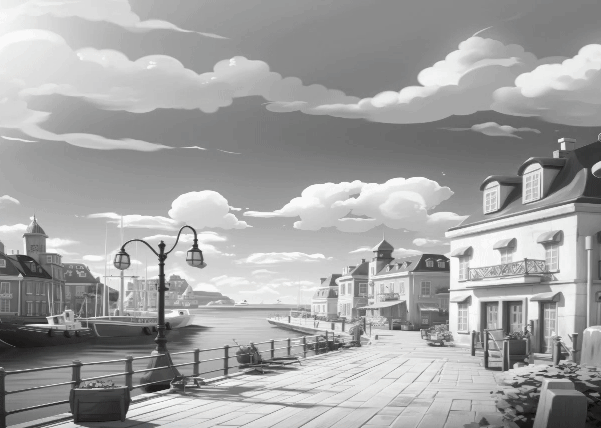

# CocosGrayScaleShader
## 🎨 Cocos Creator Three-Mode Color Filter Shader


## Checkout my blog post to see the process and thoughts that went behind making this
https://codeinterstellar.medium.com/creating-dynamic-filter-effect-in-cocos-creator-a-three-mode-shader-guide-e29b32fab5a9

**An optimized shader for Cocos Creator 3.8.2** supporting:

* Black & White (threshold-based)
* Grayscale (perceptual luminance)
* Color Tween (grayscale-to-color transition)

Perfect for stylized cutscenes, damage effects, tone shifts, and real-time visual transitions — all from a **single shader**!

---

### 📂 File: `ColorFilter.effect`

Located in:

```
assets/effects/ColorFilter.effect
```

---

### 🔧 Features

| Mode         | Description                                    |
| ------------ | ---------------------------------------------- |
| `0`          | **Black & White** using threshold binarization |
| `1`          | **Grayscale** using perceptual luminance       |
| `2`          | **Color Tween** from grayscale to full color   |

---

### Luminance Model

Uses perceptual weights based on the **Rec. 709 standard**:

```glsl
vec3 LUMINANCE_WEIGHTS = vec3(0.2126, 0.7152, 0.0722);
float luminance = dot(color.rgb, LUMINANCE_WEIGHTS);
```

This gives more accurate results than `(R + G + B) / 3`, especially for natural skin tones and foliage.

---

### 🧪 Shader Parameters

| Uniform       | Type    | Description                                       |
| ------------- | ------- | ------------------------------------------------- |
| `mode`        | `int`   | 0 = BW, 1 = Grayscale, 2 = Color Tween            |
| `bwThreshold` | `float` | Luminance threshold (used in BW mode)             |
| `colorTween`  | `float` | Blend factor (0 = gray, 1 = color) for Tween mode |

---

### ✍️ Sample Code to Change Mode at Runtime

```ts
// TypeScript (Cocos Creator)
const mat = sprite.getMaterial(0);
mat.setProperty('mode', 2); // Tween mode
mat.setProperty('colorTween', 0.5); // Mid-transition
```

---

### ⚡ Bonus: Inverted Black & White

To enable inverted output in **BW mode**, just replace this:

```glsl
float bw = step(bwThreshold, luminance);
baseColor.rgb = vec3(bw);
```

with this:

```glsl
float invertedBW = 1.0 - step(bwThreshold, luminance);
baseColor.rgb = vec3(invertedBW);
```

Screenshots:

---

> Recommended modes:
>
> * Original Sprite
> * Grayscale
> * Black & White
> * Color Tween Progression

---

### Installation

1. Copy `ColorFilter.effect` into your project (`assets/effects/`)
2. In Cocos Creator:

   * Right-click → **Create → Material**
   * Assign the shader to the new material
   * Attach the material to any sprite or UI element

---

### 📚 License

MIT License © Ketan Shukla
Attribution appreciated, but not required.

